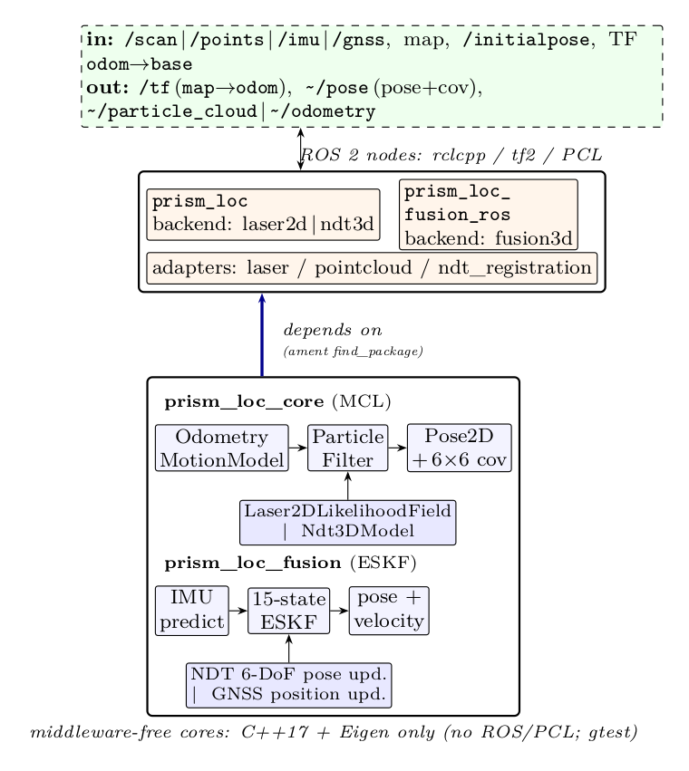
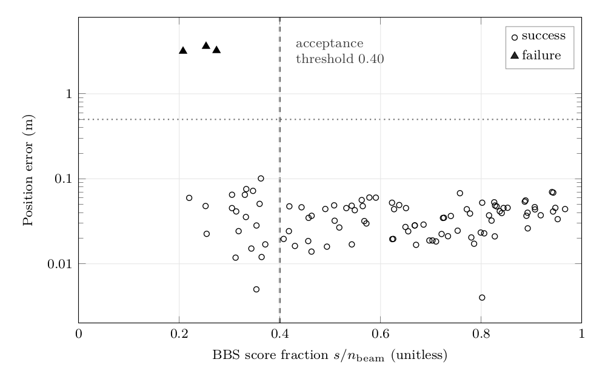
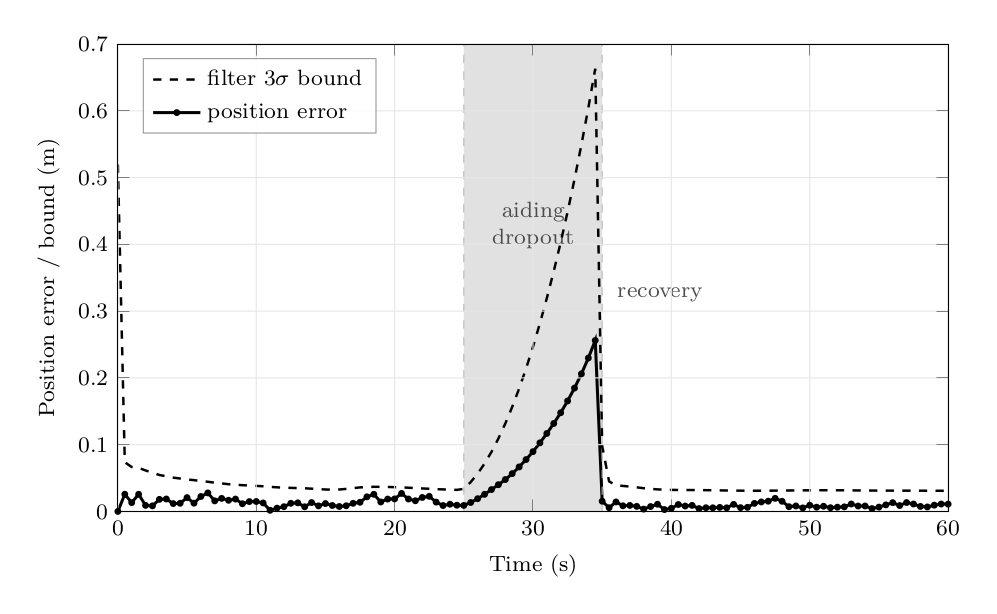
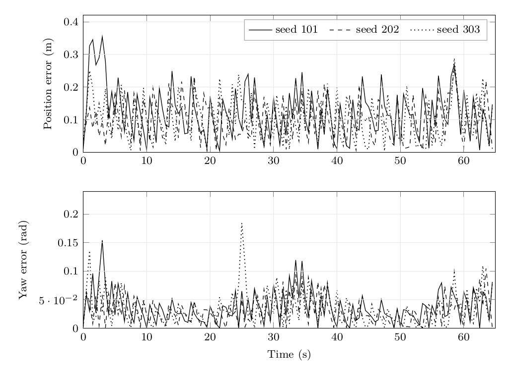

<div align="center">

# PRISM-Loc

**A pluggable LiDAR localization stack for ROS 2 Humble — three backends over
shared middleware-free estimator cores, one standard `map → odom` contract.**

[](https://github.com/kjungmo/prism_loc/actions/workflows/ci.yml)
[](LICENSE)

[](docs/paper/main.pdf)
[](https://github.com/sponsors/kjungmo)

[Overview](#overview) &nbsp;·&nbsp; [Paper](#-paper) &nbsp;·&nbsp;
[Install](#-prerequisites) &nbsp;·&nbsp; [Quick start](#-quick-start) &nbsp;·&nbsp;
[Evaluation](#-evaluation-synthetic) &nbsp;·&nbsp; [Docs](#-documentation) &nbsp;·&nbsp;
[Roadmap](#-roadmap)



</div>

`prism_loc` localizes a mobile robot inside a prior map from a **2D LiDAR**
(`LaserScan` vs `OccupancyGrid`), a **3D LiDAR** (`PointCloud2` vs a `.pcd` map),
or a **3D LiDAR fused with IMU and RTK-GNSS**. Pick a backend; the output contract
— `map→odom` TF, pose with covariance, `/initialpose` seeding — follows the
`nav2_amcl` / `hdl_localization` / `robot_localization` conventions ROS users
already know.

## 📢 News

- **2026-07** — `v0.1` released: `laser2d`, `ndt3d`, and `fusion3d` backends,
  branch-and-bound global relocalization, and a systems-paper draft with a
  fully reproducible synthetic evaluation
  ([`docs/paper/main.pdf`](docs/paper/main.pdf)).

## Overview

| Backend | Sensors | Map | Estimator | State | Global relocalization |
|---|---|---|---|---|---|
| **`laser2d`** | 2D LiDAR + wheel odometry (TF) | `OccupancyGrid` (`map.yaml`) | likelihood-field MCL, KLD-adaptive | planar (x, y, yaw) | ✅ branch-and-bound (BBS), param or on-demand service |
| **`ndt3d`** | 3D LiDAR + wheel odometry (TF) | `.pcd` point cloud | NDT-MCL (same particle-filter core) | planar (x, y, yaw) | — (`/initialpose`) |
| **`fusion3d`** | 3D LiDAR + IMU + RTK-GNSS | `.pcd` point cloud | 15-state error-state Kalman filter | full 6-DoF + IMU biases | auto-init from IMU attitude + first valid RTK fix |

**Why "PRISM"** — **P**article-filter · **R**TK · **I**nertial ·
**S**can-matching: the four ingredients this stack fuses to localize against a
prior map. The name also nods to the optics: a prism splits one beam into its
components, just as `prism_loc` splits one estimator core into multiple
sensor/observation paths — grounded in **NDT-MCL** (Saarinen et al., IROS 2013),
which showed a 3D NDT map can serve as the measurement model inside the very
same particle filter that 2D AMCL uses.

**Design principle** — all filter mathematics live in two pure C++17 + Eigen
libraries (`prism_loc_core`, `prism_loc_fusion`) with **no ROS and no PCL**,
unit-tested deterministically with gtest and a seedable RNG. `rclcpp`, `tf2`,
and PCL appear only in the two thin node packages (`prism_loc`,
`prism_loc_fusion_ros`). CI builds both paths: the bare-`cmake` cores and the
full `colcon` workspace in a `ros:humble` container. It then runs the nodes over
real ROS topics: each shipped launch file starts headless on generated maps and
[`scripts/check_param_binding.py`](scripts/check_param_binding.py) fails if any
YAML key is not declared and applied, and
[`scripts/synthetic_e2e.py`](scripts/synthetic_e2e.py) drives `laser2d` on a
synthetic world (ray-cast scans, drifting odometry) and asserts position error
≤ 0.15 m and yaw error ≤ 0.05 rad after 10 s, a `map→odom` stamp lead of
0–0.15 s, and no TF gap over 0.5 s; after a 7 s scan gap, `map→odom` resumes
within 1 s and the position error is ≤ 0.15 m from 15 s after the gap
(re-convergence measured 3–12 s; a 3 s bound is not met by the current filter).
It also asserts poses at a 0.1x simulated clock and with a coarse (10 Hz,
0.5x) simulated clock, with scans stamped ahead of odometry, no low-n_eff warning after `/initialpose` on a standing robot, and the
`/diagnostics` status for stopped scans, missing odometry, zero-stamped scans and a
stuck ROS clock. This is a ROS-path check on synthetic data, not a field result.
GoogleTest cases: 42 in `prism_loc_core`, 15 in `prism_loc_fusion`, 18 in
`prism_loc`, 4 in `prism_loc_fusion_ros` (79 in total).

Run the same checks locally from a built workspace (`rosdep install` as below,
plus `sudo apt-get install python3-numpy python3-yaml`):
```bash
source install/setup.bash
bash src/prism_loc/scripts/launch_checks.sh laser2d ndt3d fusion3d
python3 src/prism_loc/scripts/synthetic_e2e.py install/prism_loc/share/prism_loc/params/laser2d.yaml
```

**TF waits.** A lookup of `odom→base_link` at a scan's stamp waits for odometry to
catch up: 0.1 s of ROS time (plus up to 30 ms when the clock moved 30 ms or more in
the poll that reaches the budget), capped at 1 s of steady time. Limits: a `/clock` that changes less often
than once per second of wall time counts as frozen and is not waited on; below 0.1x
the 1 s cap ends the wait before 0.1 s of ROS time; the callback in which a clock
stops can hold up to the cap. Whether the clock is frozen is judged across waits, so
a coarse `/clock` (for example 10 Hz of sim time at 0.5x) still gets its full 0.1 s.
The buffer is polled every 10 ms as in `tf2_ros`; a live clock (about 10 ms per poll)
gets the 30 ms grace only when that poll is delayed by 30 ms or more, so a live robot
otherwise behaves as with `tf2_ros`. Smooth playback at about 3x or faster moves 30 ms
or more per poll and always gets the grace.

## 📄 Paper

The architecture, estimator cores, interface contract, and a reproducible
synthetic evaluation are described in the systems-paper draft (LaTeX sources +
PDF under [`docs/paper/`](docs/paper/)):

> **PRISM-Loc: Three LiDAR Localization Backends Behind One ROS 2 Contract,
> with Middleware-Free Estimator Cores** — [PDF](docs/paper/main.pdf)

The paper describes commit cdb81bf; later commits add tests and the `/diagnostics`
status, and with default parameters leave the estimates unchanged except that scans
and clouds with a zero header stamp are now dropped.

If `prism_loc` is useful in your research, please cite it
(see also [`CITATION.cff`](CITATION.cff)):

```bibtex
@unpublished{kang2026prismloc,
  author = {Kang, Jung Mo},
  title  = {{PRISM-Loc}: Three {LiDAR} Localization Backends Behind One
            {ROS}~2 Contract, with Middleware-Free Estimator Cores},
  year   = {2026},
  note   = {Draft manuscript, available at
            \url{https://github.com/kjungmo/prism_loc} under docs/paper/},
}
```

## ⚙️ Prerequisites

**Core-only path (no ROS)** — builds/tests the two estimator libraries by
themselves. This is exactly what CI installs in
[`.github/workflows/ci.yml`](.github/workflows/ci.yml):
```bash
sudo apt-get update
sudo apt-get install -y --no-install-recommends cmake g++ libeigen3-dev libgtest-dev
```

**Full ROS path** — needed for the launch files / RViz / TF:
1. Install [ROS 2 Humble](https://docs.ros.org/en/humble/Installation.html)
   (`ros-humble-desktop` — includes `rviz2`).
2. From the workspace root (with this repo checked out at
   `<ws>/src/prism_loc`), resolve the ROS package dependencies declared in each
   `package.xml` (pulls in `nav2_map_server`, `nav2_lifecycle_manager`,
   `rviz2`, PCL, ...):
   ```bash
   rosdep install --from-paths src --ignore-src -r -y
   ```

## 🚀 Quick start

```bash
# 1. Estimator cores — build & test with the plain system toolchain (no ROS):
cmake -S prism_loc_core   -B build/core   -DPRISM_LOC_CORE_BUILD_TESTS=ON
cmake -S prism_loc_fusion -B build/fusion -DPRISM_LOC_FUSION_BUILD_TESTS=ON
cmake --build build/core   -j && ( cd build/core   && ctest --output-on-failure )
cmake --build build/fusion -j && ( cd build/fusion && ctest --output-on-failure )

# 2. Full ROS 2 Humble build (workspace):
#    place this repo at <ws>/src/prism_loc, then:
rosdep install --from-paths src --ignore-src -r -y
colcon build --symlink-install
colcon test --packages-select prism_loc_core prism_loc prism_loc_fusion prism_loc_fusion_ros

# 3. Run — 2D LiDAR (MCL):
ros2 launch prism_loc laser2d.launch.py map:=/path/to/map.yaml
#    3D LiDAR (NDT-MCL):
ros2 launch prism_loc ndt3d.launch.py map_pcd_path:=/path/to/map.pcd
#    3D LiDAR + IMU + RTK-GNSS (ESKF fusion):
ros2 launch prism_loc_fusion_ros fusion3d.launch.py map_pcd_path:=/path/to/map.pcd
#    laser2d/ndt3d: click "2D Pose Estimate" in RViz to seed; fusion3d
#    auto-initializes once it has IMU attitude + a valid RTK fix
#    (or use /initialpose).
```

All three launch files accept `use_sim_time` (default `false`). Leave it
`false` against a real robot; set it `true` only when replaying a bag /
running in simulation, where pose/TF are stamped from a `/clock` topic
instead of the wall clock:
```bash
ros2 launch prism_loc laser2d.launch.py map:=/path/to/map.yaml use_sim_time:=true
```

### Verify it's working

After launching, check the node came up and is actually publishing pose/TF:
```bash
ros2 topic echo /prism_loc/pose --once
ros2 run tf2_ros tf2_echo map odom
```
(`fusion3d` runs as node `prism_loc_fusion`, so its pose topic is
`/prism_loc_fusion/pose` instead.)

Expected startup log lines (`RCLCPP_INFO`, from
[`prism_loc/src/localization_node.cpp`](prism_loc/src/localization_node.cpp) and
[`prism_loc_fusion_ros/src/fusion_localization_node.cpp`](prism_loc_fusion_ros/src/fusion_localization_node.cpp)):
- laser2d: `"prism_loc up: backend=laser2d"` then, once the map arrives,
  `"laser2d: map received (%dx%d)"` (plus
  `"laser2d: BBS global-localization matcher ready"` if
  `try_global_localization:=true`)
- ndt3d: `"ndt3d: NDT map built (%zu voxels)"` then `"prism_loc up: backend=ndt3d"`
- fusion3d: `"fusion3d: NDT map loaded (%zu pts)"` then
  `"prism_loc_fusion (fusion3d) up"`, then, once IMU+position priors land,
  `"fusion3d: initialized at (%.2f, %.2f, %.2f)"`

If any of these don't show up, or the pose/TF commands above hang or print
nothing, see [`TROUBLESHOOTING.md`](TROUBLESHOOTING.md).

### Runtime status (`/diagnostics`)

Both nodes publish a `diagnostic_msgs/DiagnosticArray` on `/diagnostics` once per
second from a wall-clock timer, so the status keeps coming when inputs stop or the
ROS clock is stuck. Status names are `prism_loc: localization` and
`prism_loc_fusion: fusion` (hardware_id = node namespace); watch them with
`ros2 topic echo /diagnostics` or `rqt_robot_monitor`.

| Level | `prism_loc` (laser2d / ndt3d) | `prism_loc_fusion` (fusion3d) |
|---|---|---|
| ERROR | no map, no scans/clouds, or no pose seed after `startup_timeout_s` (30 s); scans/clouds stopped for `max(input_timeout_s, input_timeout_periods x observed period)` | no IMU or no initialization after `startup_timeout_s`; IMU stopped |
| WARN | odom or sensor TF lookups failing; relocalization pending, ambiguous or without candidate; effective particle count below `min_neff_fraction`; zero-stamped scans dropped; `use_sim_time` on while the ROS clock does not advance | no accepted NDT correction for `correction_timeout_s`; `odom->base_link` lost after being seen, or appearing while the map->base_link fallback was broadcast (two parents); fallback off and no odometry (no TF); IMU gaps; ROS clock not advancing under `use_sim_time` |

Values carried for monitors: `n_eff`, `particles`, `covariance_trace_xy`,
`covariance_yaw`, `input_rate_hz`, `seconds_since_last_input`,
`seconds_since_last_update`, `relocalization` (laser2d/ndt3d); `imu_rate_hz`,
`imu_gaps_total`, `seconds_since_ndt_correction`, `seconds_since_gnss_correction`,
`ndt_rejected_total`, `covariance_trace_position`, `tf_child_frame`,
`map_to_base_fallback_active` (fusion3d). A fusion3d robot without odometry that
runs on the `map→base_link` fallback by design reports OK with
`map_to_base_fallback_active=true`; it WARNs only when `odom→base_link` was seen and
then lost, or when odometry appears while the fallback was being broadcast (two
parents for `base_link`).

Status names follow the `diagnostic_updater` convention: `<node name>: ...` with the
namespace as `hardware_id`. In a multi-robot setup either namespace or remap
`/diagnostics` per robot or give each node a unique name, or the statuses of
different robots carry the same name.

## 📊 Evaluation (synthetic)

The paper ships a **fully reproducible synthetic evaluation**: three
closed-loop experiments compile the *actual* estimator cores directly with
`g++` (no ROS, no CMake), drive them through end-to-end localization
scenarios with fixed seeds, and write the CSVs committed under
[`docs/paper/data/`](docs/paper/data/). Every number and figure below is
recomputable from those drivers ([`experiments/`](experiments/)); a committed
guard script ([`docs/paper/check_numbers.py`](docs/paper/check_numbers.py))
asserts the quoted statistics still trace to the CSVs. This is a correctness
and behavior demonstration on synthetic data — **not** a field-accuracy
benchmark; evaluation on public datasets is on the [roadmap](#-roadmap).

| | |
|:---:|:---:|
|  |  |
| **Global relocalization (BBS)** — 100 kidnapped-robot queries: **97 % success**, median error **0.037 m / 0.48°**, zero false accepts at the score threshold, median full-map latency 37.65 ms. | **ESKF under aiding dropout** — position RMSE **0.016 m → 0.125 m → 0.009 m** before/during/after a 10 s IMU-only blackout; the filter's 3σ bound stays above the true error throughout. |

<div align="center">


**MCL tracking** — 65 s closed loop, three seeds: steady-state mean position
error **0.105 m**, mean yaw error **1.8°**; KLD resampling shrinks the
particle set 2000 → 500 (4× fewer likelihood evaluations) after convergence.
</div>

## 🗺️ Building a map

**laser2d** consumes a standard Nav2 2D map (`map.yaml` + `.pgm`). Build one
with [`slam_toolbox`](https://github.com/SteveMacenski/slam_toolbox) while
driving/teleoperating the robot through the space, then save it with
`nav2_map_server`'s saver once the map looks complete:
```bash
ros2 run nav2_map_server map_saver_cli -f /path/to/map
#   -> writes /path/to/map.yaml + /path/to/map.pgm; point laser2d.launch.py's
#      map:= argument at the .yaml.
```

**ndt3d** / **fusion3d** consume a single prior `.pcd` point cloud
(`map_pcd_path`). `prism_loc` itself is localization-only — it does not ship a
mapping node — so build the map with a separate 3D SLAM/registration pipeline,
then hand the result to `prism_loc`:
1. Drive the robot through the space once, recording the raw cloud (and TF)
   to a bag: `ros2 bag record -o mapping_bag /points /tf /tf_static`.
2. Post-process the bag with a 3D SLAM/scan-registration pipeline (e.g.
   a LiDAR-inertial odometry package or PCL registration) to produce
   one globally-consistent point cloud.
3. Save that merged, downsampled cloud as a single named `.pcd` file (e.g.
   `pcl::io::savePCDFileBinary("/path/to/map.pcd", merged_cloud)`).
4. Point `map_pcd_path:=/path/to/map.pcd` at it for `ndt3d.launch.py` /
   `fusion3d.launch.py`.

## 🔌 Interface

| Backend | Package | Input | Output |
|---|---|---|---|
| **laser2d** | `prism_loc` | `/scan`, `/map`, `/initialpose`, TF `odom→base` | `/tf` `map→odom`, `~/pose`, `~/particle_cloud` |
| **ndt3d** | `prism_loc` | `/points`, `map.pcd`, `/initialpose`, TF `odom→base` | same |
| **fusion3d** | `prism_loc_fusion_ros` | `/points`, `/imu`, `/gnss` (NavSatFix), `map.pcd`, `/initialpose` | `/tf` `map→odom`, `~/pose`, `~/odometry` |

All backends also publish `/diagnostics` (see [Runtime status](#runtime-status-diagnostics)).
`fusion3d` broadcasts `map→base_link` instead of `map→odom` while no
`odom→base_link` transform exists (`map_to_base_fallback`, default `true`). If wheel
odometry or an EKF publishes `odom→base_link` and may start after `fusion3d`, set
`map_to_base_fallback: false`; otherwise `base_link` briefly has two parents in the
TF tree.

## 📚 Documentation

| Document | Contents |
|---|---|
| [`docs/paper/main.pdf`](docs/paper/main.pdf) | Systems paper: architecture, estimator cores, interface contract, synthetic evaluation |
| [`PARAMS.md`](PARAMS.md) | Every `laser2d`/`ndt3d`/`fusion3d` parameter, its default, and its meaning |
| [`TROUBLESHOOTING.md`](TROUBLESHOOTING.md) | Symptom → cause → fix for the common failure modes, with the `/diagnostics` message each one produces |
| [`SPEC.md`](SPEC.md) / [`SPEC_fusion.md`](SPEC_fusion.md) | Full design specifications |
| [`experiments/README.md`](experiments/README.md) | How to rebuild and rerun the synthetic evaluation |

## 🧭 Roadmap

`v0.1` ships 2D likelihood-field MCL and 3D NDT-MCL (planar x, y, yaw), plus a
3D LiDAR + IMU + RTK-GNSS error-state Kalman fusion (`fusion3d`) with full
6-DoF state and IMU-bias estimation. The `laser2d` backend self-initializes
via branch-and-bound (BBS) global localization with no `/initialpose` (param
`try_global_localization`, on-demand service `~/global_localization`): the
top-K distinct BBS modes of the first scan are verified over several
odometry-chained scans, and the pose is committed only when one hypothesis
dominates the posterior; otherwise the node reports the place as ambiguous
instead of re-seeding (`bbs_verify_*` params). Planned:

- [ ] Quantitative field evaluation (ATE/RPE) on public datasets
- [ ] 3D global localization for `ndt3d` / `fusion3d`
- [ ] Tight LiDAR–IMU time-offset estimation
- [ ] Sample map + bag pair for a known-good first run

## 🙏 Acknowledgements

`prism_loc` claims no new estimator theory — it stands on well-known work and
conventions: **MCL / AMCL** (Dellaert, Fox, Thrun et al.; `nav2_amcl`),
**NDT & NDT-MCL** (Biber & Straßer; Magnusson; Saarinen et al.),
**branch-and-bound scan matching** (Olson; Hess et al., Cartographer),
**error-state Kalman filtering** (Solà), and the ROS interface patterns of
[`robot_localization`](https://github.com/cra-ros-pkg/robot_localization) and
[`hdl_localization`](https://github.com/koide3/hdl_localization). See the
paper's Related Work section for the full positioning.

## 💛 Sponsor

If `prism_loc` saves you time, consider
[sponsoring](https://github.com/sponsors/kjungmo). Sponsorship funds
maintenance, new features, and faster issue response. Backers will be
acknowledged here — thank you.

## License

Apache-2.0.
